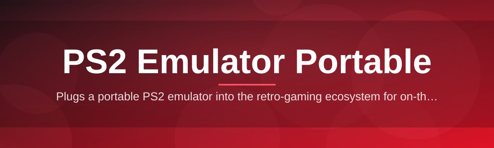

# ps2-emulator-config-editor 🕹️🔧

  

*A friendlier way to tune your PS2 emulator's portable configuration — no registry archaeology required.*

  

## 📖 Overview

Every emulation setup has that one moment: you dig through a scattered set of INI files, GS plugin settings, and memory card paths, trying to remember which value controls widescreen patches versus which one controls frame pacing. `ps2-emulator-config-editor` started as a weekend fix for that exact headache — a small internal tool that grew into a full configuration companion once other contributors realized their portable PS2 emulator builds had the same tangled settings sprawl.

At its core, this project is a lightweight desktop utility built specifically around the *portable* distribution model that PS2 emulation enthusiasts favor — no installer, no system-wide footprint, everything self-contained next to your emulator folder. Rather than replacing the emulator itself, we sit alongside it as a translation layer: reading the raw configuration format, presenting it as something human, and writing it back out exactly the way the emulator expects it. That "read-understand-write" loop is the entire philosophy behind the architecture, and it's why the tool stays fast even on modest hardware.

This project is for the people who maintain portable emulation kits on USB drives, the folks who batch-configure dozens of game-specific profiles, and the contributors who just enjoy building small, focused developer tools. Whether you're chasing better compatibility for a specific title or just want a saner interface than a raw text editor, this is built for you.

---

## ✨ What It Actually Does

We laid this out as a table instead of a wall of bullets — because a configuration editor is, fundamentally, about relationships between settings, and a table communicates that better.

| Capability | Why It Matters |
|---|---|
| **Profile-Aware Editing** | Portable PS2 setups often juggle per-game overrides. The editor understands profile inheritance, so a global setting doesn't silently get shadowed by a forgotten per-title tweak. |
| **Live Path Resolution** | Because the tool is portable, absolute paths are the enemy. It resolves memory card, BIOS, and plugin paths relative to the emulator's own folder, so your whole kit stays USB-drive-friendly. |
| **Safe Write-Back** | Configuration files get backed up automatically before every save — the editor treats your working config as sacred, not disposable. |
| **Human-Readable Labels** | Cryptic internal keys (like raw hex flags for GS renderer modes) are translated into plain descriptions, with the raw value still visible for power users. |
| **Diff-Before-Save Preview** | Before committing changes, you see exactly which lines will change — a small habit borrowed from version control that prevents "wait, what did I just do" moments. |
| **Batch Profile Sync** | Apply a tested setting (say, a frame-pacing fix) across every game profile in one pass, instead of repeating manual edits. |
| **Portable-First Storage** | Nothing writes to the Windows registry. Settings, backups, and logs live in the same folder tree you can zip and move anywhere. |
| **Validation Guardrails** | Out-of-range or mutually exclusive settings are flagged before save, catching the kind of typo that leads to a black screen on boot. |

> [!TIP]
> If you maintain a portable emulation kit across multiple PCs, keep the entire tool folder inside your emulator's root directory. Every path it manages stays relative, so moving the whole kit to a new machine just works.

---

## 🚀 Getting Started

1. Visit the landing page using the download button above or below.

2. Grab the latest portable build — it arrives as a single self-contained folder, nothing to unpack into `System32` or anywhere sacred.

3. Drop that folder next to (or inside) your existing PS2 emulator directory.

4. Launch the executable — the editor auto-detects nearby configuration files on first run and asks you to confirm before touching anything.

> [!NOTE]
> First launch always opens in **read-only preview mode**. You have to explicitly enable editing from the toolbar — this is intentional, so nothing changes without your say-so.

---

## 🖥️ System Requirements

   

- Windows 10 or Windows 11 (64-bit)

- No .NET, Java, or Visual C++ redistributables required — everything is bundled

- Roughly 40 MB of disk space, plus whatever your backups accumulate

- No admin rights needed; runs entirely from user space

- Works from local drives, external drives, or network shares

---

## 🧩 How It Works

The architecture follows a deliberately simple pipeline. Configuration editing tools have a bad habit of becoming bloated state machines, so we kept this one honest:

1. **Discover** — the tool scans the target directory for known configuration file signatures.

2. **Parse** — raw key-value pairs and binary flags are loaded into an in-memory model, decoupled from the file format.

3. **Edit** — you interact with the human-readable model through the UI; nothing touches disk yet.

4. **Validate** — every pending change is checked against known-safe ranges and dependency rules.

5. **Commit** — a backup is written, then the original file is updated atomically.

> [!IMPORTANT]
> The commit step never edits a file in place. It writes to a temporary file first, then swaps it in — so a mid-write crash or a yanked USB drive can't leave you with a half-written, unreadable config.

---

## 🛟 Troubleshooting

**Q: The editor says it can't find any configuration files. What now?**
A: Make sure the tool sits at the same folder depth as your emulator's config directory. It searches nearby folders, not the entire drive, to stay fast and avoid touching unrelated files.

**Q: I edited a setting and my game won't boot anymore.**
A: Open the Backups panel — every save creates a timestamped restore point. Roll back to the last known-good backup and try again.

**Q: Why does the tool refuse to save some values I typed in manually?**
A: That's the validation layer catching an out-of-range or conflicting value. Hover over the flagged field for an explanation of the safe range.

**Q: My portable kit moved to a new PC and paths look broken.**
A: Confirm the editor's own folder moved along with the emulator's folder structure. Paths are resolved relative to that root — if the relative layout changed, re-run Discover.

**Q: Does this modify the emulator's BIOS or game files?**
A: No. It strictly reads and writes configuration/settings files — it never touches BIOS images or game data.

**Q: The UI looks blank or unstyled after an update.**
A: Delete the local theme cache folder inside the tool's directory and relaunch — it regenerates automatically.

---

## 🎨 Interface & Experience

<strong>Keyboard shortcuts</strong>

| Shortcut | Action |
|---|---|
| `Ctrl+S` | Save current profile |
| `Ctrl+Shift+S` | Save as new profile |
| `Ctrl+Z` | Undo last change |
| `Ctrl+F` | Search settings |
| `F5` | Re-run Discover scan |
| `Ctrl+B` | Open Backups panel |

<strong>Themes & appearance</strong>

- Light and Dark themes ship out of the box

- A high-contrast theme is available for accessibility

- Theme choice is stored locally in the portable settings folder — it travels with your kit

<strong>Settings panel highlights</strong>

- Toggle whether backups auto-prune after 30 days

- Choose strict or relaxed validation mode

- Enable a compact layout for smaller screens

> [!WARNING]
> Relaxed validation mode disables several safety checks. It's meant for advanced users experimenting with unsupported configuration combinations — use it deliberately, not by accident.

---

## 🤝 Contributing & Community

This project runs on community goodwill, and we mean that literally — most of the parsing logic for niche configuration formats came from contributors who owned the hardware quirk in question.

- Check the issue tracker for labels like `good-first-issue` and `help-wanted` — they're curated to be approachable

- Discussion threads are open for feature proposals before any code gets written, so design conversations happen in the open

- Small pull requests (docs fixes, translation strings, tiny bug fixes) are welcomed just as warmly as large ones

> [!TIP]
> New to the codebase? Start with a `good-first-issue`. They're intentionally scoped to be finishable in an evening, and reviewers prioritize them.

---

## 📄 License

Released under the [MIT License](LICENSE), 2026.

---

## ⚠️ Disclaimer

This project is an independent, community-built configuration utility. It is not affiliated with, endorsed by, or associated with Sony Interactive Entertainment or any official PlayStation product. It does not distribute BIOS files, copyrighted game data, or any emulator binaries — it only manages configuration files for software you already have installed. Use responsibly and in accordance with your local laws regarding emulation.

